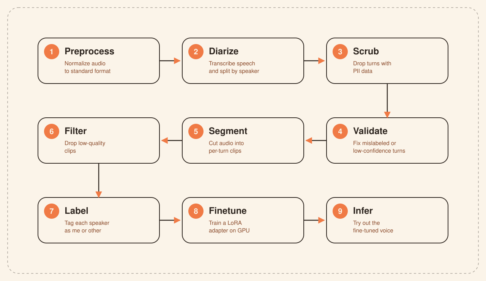

<p align="center">
  <picture>
    <source media="(prefers-color-scheme: dark)" srcset="assets/banner-dark.svg">
    <source media="(prefers-color-scheme: light)" srcset="assets/banner-light.svg">
    
  </picture>
</p>

> A pipeline for preparing data from personal audio call recordings and then fine-tuning LLMs using LoRA.

## Why

Someone said to me "I like your voice". I thought I need to make my own LLM that sounds like me. Just kidding, no one likes to hear me talk, but I thought it would be fun to try. Anyways, one day I realised my mobile phone automatically records calls and that I had 22 hours of audio data. I didn't know what to do with it, so I thought it would be fun to try to fine-tune an LLM and make it sound like me.

My recordings were in multiple languages (English, Hindi, Marathi, Mixed), some of poor quality, some with background noise, some with more than 2 speakers, some with cross-talk, and so many other issues. I have never worked with audio before and really wanted to understand audio processing concepts. Furthermore, I really liked the challenging aspect of cleaning and preparing this dataset. The majority of the project focuses on data preparation.

I also find training and fine-tuning LLMs pretty fun and challenging. How can different hyperparameters make a big difference in the final result? How does data quality affect the training? How does LoRA make the training more efficient? And so on.

So, if you are also interested in fine-tuning LLMs for your own audio data, this pipeline might be for you.

> [!WARNING]  
> (a) This project is not production ready and was created for learning and experimentation purposes.   
> (b) Please do not use this for any illegal or unethical purposes.

## Install & run

### Step 1:

This is a Python project that uses [`uv`](https://docs.astral.sh/uv/) to manage dependencies.

If you don't have [`uv`](https://docs.astral.sh/uv/) installed, you can install it with:

```bash
curl -LsSf https://astral.sh/uv/install.sh | sh
```

To install the dependencies, run:

```bash
# If you don't want all the dependencies, you can install only the ones you need
# The groups are: local, gcp, aws, infer (uv sync --extra <group>)
# Or else just install everything
uv sync --all-extras
```

### Step 2:

Copy `.env.sample` → `.env` and fill in whatever's relevant to your setup. (All the details about each environment variable and more setup steps for each are in the `.env.sample` file.)

### Step 3:

Drop audio files into `input/`

### Step 4:

Run the pipeline (completely or in segments — see examples below):

```bash
uv run python -m voicetune.run --mode mlx                 # the whole thing
uv run python -m voicetune.run --steps 1-7                # stop before training
uv run python -m voicetune.run --steps 1-7 --resume       # pick up where it crashed
uv run python -m voicetune.stages.infer                   # Gradio inference UI at :7860
```

## How it works

Simple nine-stage linear pipeline. Each reads the previous stage's output directory and writes its own.

<p align="center">
  <picture>
    <source media="(prefers-color-scheme: dark)" srcset="assets/pipeline-dark.svg">
    <source media="(prefers-color-scheme: light)" srcset="assets/pipeline-light.svg">
    
  </picture>
</p>


| #   | Stage                                       | Input                       | Output                              | Library stack                            |
| --- | ------------------------------------------- | --------------------------- | ----------------------------------- | ---------------------------------------- |
| 1   | [preprocess](llm-notes/step1-preprocess.md) | Any audio format            | 16 kHz mono normalized WAV          | PyAV                                     |
| 2   | [diarize](llm-notes/step2-diarize.md)       | Mono WAV                    | Transcripts with speaker timestamps | mlx-pyannote/whisperx/aws-transcribe/LLM |
| 3   | [scrub](llm-notes/step3-scrub.md)           | Raw transcripts             | PII-free transcripts                | LLM                                      |
| 4   | [validate](llm-notes/step4-validation.md)   | Scrubbed transcripts        | Corrected speaker labels            | LLM                                      |
| 5   | [segment](llm-notes/step5-segment.md)       | Corrected transcripts + WAV | Per-turn WAV files                  | PyAV                                     |
| 6   | [filter](llm-notes/step6-filter.md)         | Per-turn WAV files          | High-quality clips only             | -                                        |
| 7   | [label](llm-notes/step7-label.md)           | High-quality clips          | Speaker tagged as `me` or `other`   | Pyannote                                 |
| 8   | [finetune](llm-notes/step8-finetune.md)     | Labeled target clips        | LoRA checkpoints                    | VoxCPM2 (GCP A100)                       |
| 9   | [infer](llm-notes/step9-infer.md)           | LoRA weights                | Synthesized voice UI                | Gradio                                   |


## My run

830 call recordings (~22h of audio, ~2.6 GB, languages - en, hi, mr) end-to-end on a GTX 1070/Ryzen-7 (normal) + GCP A100 (finetune).


| #   | Stage      | Output                                                      | Mode            | Cost | Time   |
| --- | ---------- | ----------------------------------------------------------- | --------------- | ---- | ------ |
| 1   | preprocess | 830 files · 22h 18m · 2.57 GB                               | CPU             | $0   | ~1 min |
| 2   | diarize    | 830 files · 7,888 turns · en 46% / hi 29% / mr 24%          | GPU whisperx    | $0   | ~5h    |
| 3   | scrub      | 827 files · PII turns dropped                               | GPU Gemma 4 E4B | $0   | ~1h    |
| 4   | validate   | 347 / 830 accepted (41.8%) · 7,875 turns                    | GPU Gemma 4 E4B | $0   | ~3h    |
| 5   | segment    | 830 files · 7,837 turns cut · 2.15 GB WAVs                  | CPU             | $0   | ~1 min |
| 6   | filter     | 262 / 830 accepted (31.6%) · 1,779 turns · 10h 40m · 546 MB | CPU             | $0   | ~1 min |
| 7   | label      | 780 **me** / 973 **other** turns · me=1h 58m                | CPU             | $0   | ~5 min |
| 8   | finetune   | 20 LoRA checkpoints (every 100 steps for 2000 steps)        | GCP A100        | ~$11 | ~3h    |


#### A few things worth calling out:

- **More focus on clean data over quantity:** 830 raw calls → 347 pass validation → 262 pass filter → 236 files usable after labeling (692 `me` turns used for training). ~28% of calls survived; only ~8.8% of my original 22h of audio ended up as training data (1h 58m of `me` speech). You can tune the filters to get more data if you want.

- **Checkpointing & Intentional Overfitting:** The training plateaued around step 400; however, I wanted more realistic results (like background noise, me making mistakes while speaking, etc.) so I trained for more steps. The best checkpoint was at step 1300. Step 2000 was too overfit but still usable. I checkpointed every 100 steps to have multiple options. This is one of the reasons why I chose LoRA training over full-SFT.

- **Skewed Dataset:** My training data was a bit skewed in terms of languages (mr 41% / hi 35% / en 24%) which was actually helpful. The model I selected for fine-tuning was never trained on Marathi, so it was a good way to test if the LoRA could adapt to a new language. Similarly, the ratios of the other 2 languages also make sense for the model I chose.

#### Stuff I learned the hard way

- **Finetuning RL-trained models is not as straightforward as finetuning SFT-trained ones:** Initially, I tried to finetune [FishAudio-S2Pro](https://huggingface.co/fishaudio/s2-pro). Despite the authors' warning that it might not work, I gave it a shot. It didn't work as expected, so I had to switch to SFT training a simpler model, VoxCPM2, which actually turned out to be a really good choice of model.

- **Silences/Pauses in data make training difficult:** When your training data has too many silences/pauses, the model finds it difficult to differentiate between silence and the end token, and we get either broken audio or never-ending audio. I spent a long time figuring out why my model was generating such weird audio. To fix this, I had to remove long pauses and trailing silences from the data.


## Samples

Unfortunately, I won't be able to provide my actual voice to compare with the samples below due to security concerns. The audio below is generated from `step 300` of the checkpoint. The later checkpoints are way too accurate and for the same reason, I can't share them. The samples below are also generated using `cfg = 2.0` (i.e. letting the model generate more naturally and smoothly; CFG of 1.2-1.8 generally sounds more realistic).

| Language  | Download | Preview |
| --------- | ------ | ------- |
| English | [Sample-en.wav](https://github.com/ccd97/voicetune/raw/refs/heads/mainline/assets/samples/Sample-en.wav) | <details><summary>Expand</summary><video src="https://github.com/user-attachments/assets/e7834067-82b0-499b-8760-ba6365f0793e" controls></video></details> |
| Hindi | [Sample-hi.wav](https://github.com/ccd97/voicetune/raw/refs/heads/mainline/assets/samples/Sample-hi.wav) | <details><summary>Expand</summary><video src="https://github.com/user-attachments/assets/d426f35d-f671-4be1-a261-ea39b57f1fb1" controls></video></details> |
| Marathi | [Sample-mr.wav](https://github.com/ccd97/voicetune/raw/refs/heads/mainline/assets/samples/Sample-mr.wav) | <details><summary>Expand</summary><video src="https://github.com/user-attachments/assets/16b4256d-4e65-455c-8857-9a375331a942" controls></video></details> |


## Future Plans
The pain point of this project was diarization. Every method I used sucked.
* WhisperX - uses OpenAI's model; calls itself state-of-the-art but it sucks
* AWS Transcribe - good for non-English languages, but overall it sucks
* GCP STT - worse version of AWS Transcribe; sucks
* Pyannote - also sucks

In short, all diarization methods suck. They work well in a controlled environment but fail badly for real-world call recordings. Most of these fail due to cross-talk between speakers.

Diarization caused most of the data loss. And I really want to make diarization better. Maybe in the future I will try to finetune an existing diarization model for call recordings. Or perhaps build and train my own transformer-based LLM from scratch. Or maybe I'll be too lazy to do anything.

> [!NOTE]
> I won't be actively maintaining this project going forward. Please don't bother filing issues — if you run into bugs, the best path is to fix them yourself and raise a PR.

## FAQ

**Why bother finetuning when you can use zero-shot voice clone?**<br>
In my testing, zero-shot voice clone was great for quick results, but finetuning produces better quality and more realistic audio — zero-shot tends to lose the nuances of speed, pauses, rhythm, timbre, etc. Moreover, this was a project for me to learn the low-level workings of finetuning.

**Why did I run LLMs locally instead of using LLM providers?**<br>
I do not trust big corporations with my data (especially before the scrub stage). Additionally, it was a good learning experience to understand how to set up local LLMs and infer on them.

**Why does the Marathi inference sample sound a bit weird?**<br>
I speak a dialect of Marathi that's different from actual Marathi. The diarization model I used was trained on standard Marathi, so it introduces some errors in the transcription. I tried to find text in my dialect to use above, but couldn't, so I fell back to standard Marathi. For these reasons, the Marathi inference is not that good.

**Can I get the finetuned model weights?**<br>
Unfortunately, no. Due to security concerns, I can't share the finetuned model weights. If you still think you can convince me to share weights/audio, please reach out to me.

**What security concerns are you talking about?**<br>
The model might be used to generate fake voice clips that could be used to impersonate me in other contexts. Despite removing PII from the dataset, some other personal information might still be extracted using LLM attacks.

**I have questions? or Want to connect with me or hire me?**<br>
Sure, reach out to me at dcunha.cyprien@gmail.com.
